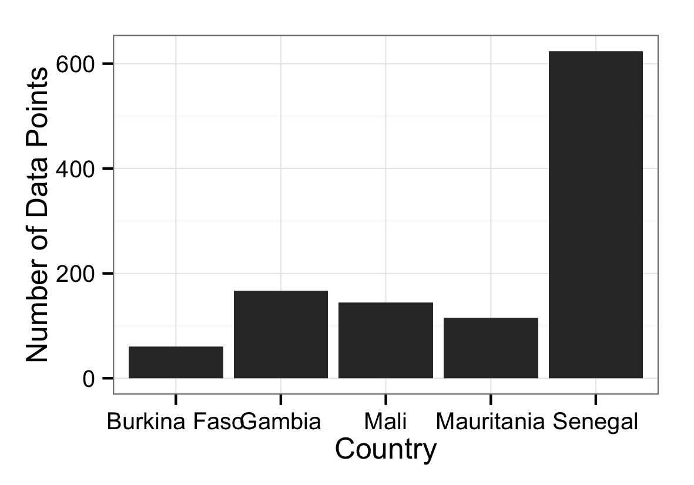
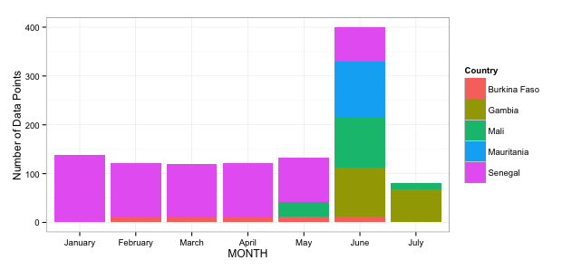

ORS in HDX
==========

From [ORS' website](http://ors.ocharowca.info/):

"The Online Reporting System (ORS) is a real- time web-based performance monitoring tool that allows UN agencies and 	NGOs participating in inter-agency planning processes (Strategic Response Plans or Emergency Action Plans) to directly 		report on the achievements based on the activities they specified during the SRP. The database has been designed to 	facilitate information sharing and monitor performance of all humanitarian interventions.

ORS is being deployed across the Sahel region (9 countries) and is managed by the OCHA Regional Office for West and 	Central Africa (ROWCA) working closely with the country offices.

The tool hosts all project data as submitted by partners during the SRP process and is also linked to the Financial 	Tracking Service (FTS) database and website that tracks funding requests and funding status of projects in inter-agency 	plans."

Data Summary
------------
ORS provides an XML feed with the 'tables' used in their system. The feed is available [here](http://ors.ocharowca.info/Anonymous/AllDataFeed.ashx).

Here is a brief summary:

- The data comes from a XML feed. Reportedly, the feed is a real-time feed.
- I created a scraper using ScraperWiki that collects the data out of that feed every day at midnight (GMT).
- The periodicity of the data is monthly.
- They monitor 160 indicators, all based on a pre-determined "Annual Target" and the currently "Achieved" at the time of reporting.
- They have data from 15 organizations that are part of 6 clusters.
- They have data about 5 countries (Burkina Faso, Gambia, Mali, Mauritania, and Senegal).
- Some indicators have data that go up to admin 1 levels. There are 41 admin 1 levels covered.

The time periodicity would be months in the reports generated. Here is the breakdown:

The table contains **160** indicators. The list of indicators is available [here](data/indicator.csv).
